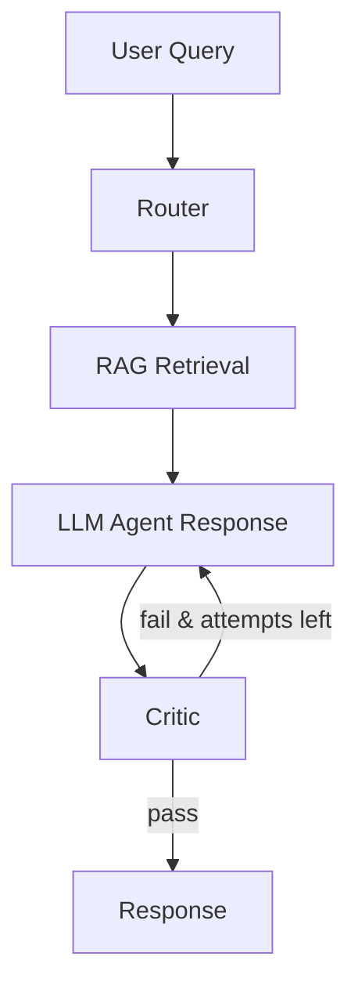

# Finnie

**Finnie is a production-ready, explainable financial intelligence assistant built with LangGraph, FastAPI, and React.**

It combines multi-agent routing, retrieval-augmented generation, portfolio analytics, and self-correcting response evaluation into a single recruiter-facing system that is easy to inspect, reason about, and demonstrate.

## Project Overview

Finnie helps users explore financial questions across market data, portfolio analysis, long-term planning, tax topics, and general financial education.

Instead of relying on a single generic chatbot, the system routes each request to the most appropriate specialist agent, retrieves supporting context when relevant, evaluates the generated answer with a critic step, and exposes execution metadata so system behavior is visible rather than opaque.

This makes the project useful as both:
- a practical AI finance assistant
- a portfolio showcase for intelligent, observable backend systems

## Architecture

The core workflow is intentionally simple and production-oriented:

`User -> Router -> RAG -> Enrichment -> LLM -> Critic -> Response`

The system uses:
- **LangGraph** for orchestration and retry control
- **FastAPI** for backend APIs
- **React + TypeScript** for the frontend
- **Chroma** for retrieval-augmented generation
- **Specialized agents** for finance Q&A, portfolios, market questions, goal planning, news, and tax

### Workflow Diagram



## Key Features

- **Multi-agent routing**: queries are routed to the most relevant financial specialist agent
- **Confidence-aware fallback**: low-confidence routes fall back to a safe finance education agent
- **Self-correction**: a critic node evaluates responses and can trigger a bounded retry loop
- **Execution trace**: the API and UI expose workflow steps so system behavior is transparent
- **Portfolio intelligence**: includes portfolio analysis, allocation insights, and supporting market data
- **Recruiter-friendly observability**: responses include metadata showing how the answer was produced

## Example API Response

```json
{
  "response": "Diversification reduces concentration risk by spreading exposure across assets, sectors, and time horizons. This is for education only; consider consulting a financial advisor.",
  "agent": "finance_qa",
  "sources": ["01_stocks_101.md", "12_risk_management.md"],
  "routing_confidence": 0.82,
  "attempt_count": 1,
  "critic_status": "pass",
  "system_status": "success",
  "execution_trace": [
    {"node": "Router", "status": "success", "attempt": 0},
    {"node": "Rag", "status": "success", "attempt": 0},
    {"node": "Data Enrichment", "status": "success", "attempt": 0},
    {"node": "Llm", "status": "success", "attempt": 1},
    {"node": "Critic", "status": "success", "attempt": 1},
    {"node": "Response Formatter", "status": "success", "attempt": 1}
  ]
}
```

## Why This Stands Out

Many AI demos stop at “LLM in, answer out.” Finnie goes further.

- **Reliable**: responses are checked before being finalized
- **Transparent**: the system exposes which agent handled the question and how the workflow progressed
- **Production-ready**: bounded retries, fallback routing, typed API contracts, and clean frontend visibility are already in place
- **Explainable**: hiring managers can inspect not only the answer, but the reasoning path the system took to generate it

This makes Finnie feel like an engineered AI application, not an experimental prototype.

## Running the Project

### Backend

```bash
python -m venv venv
venv\Scripts\activate
pip install -r requirements.txt
python run_ingest.py
python run_api.py
```

### Frontend

```bash
cd frontend
npm install
npm run dev
```

Backend runs at `http://127.0.0.1:8000` and the frontend runs at `http://localhost:5173`.

## Documentation

For deeper technical detail, see:

- [ARCHITECTURE.md](ARCHITECTURE.md)
- [API_REFERENCE.md](API_REFERENCE.md)
- [SETUP.md](SETUP.md)
- [DEPLOYMENT.md](DEPLOYMENT.md)
- [UX_GUIDE.md](UX_GUIDE.md)

## Disclaimer

Finnie is for **educational use only** and does not provide financial, tax, or legal advice.
